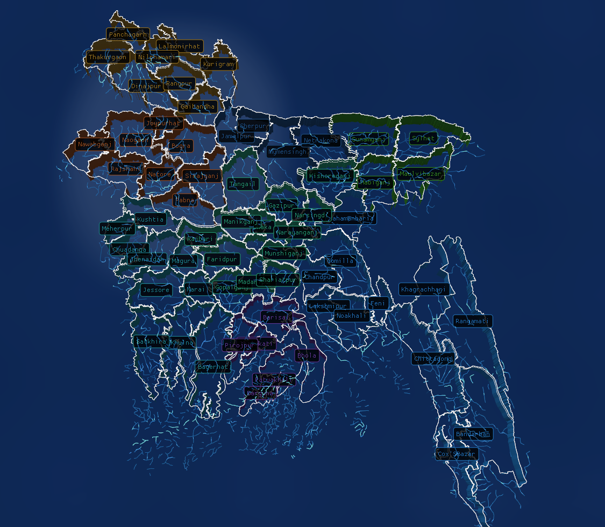
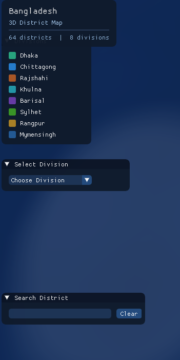
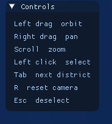
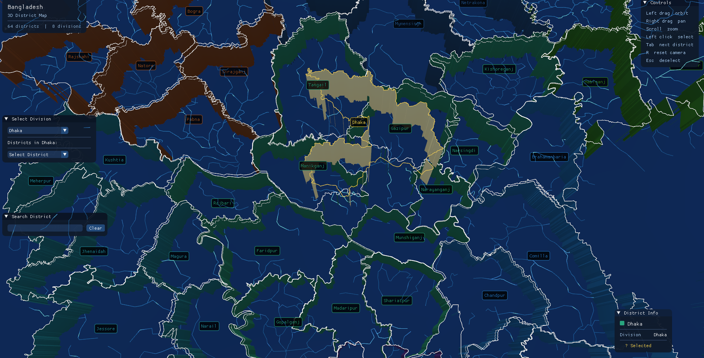
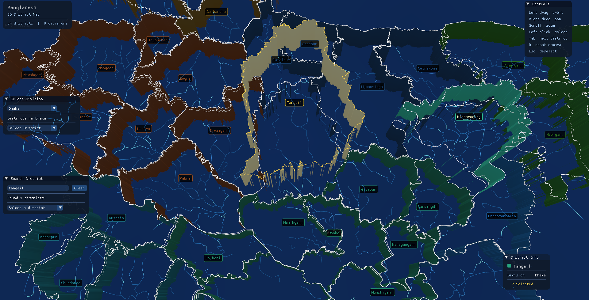
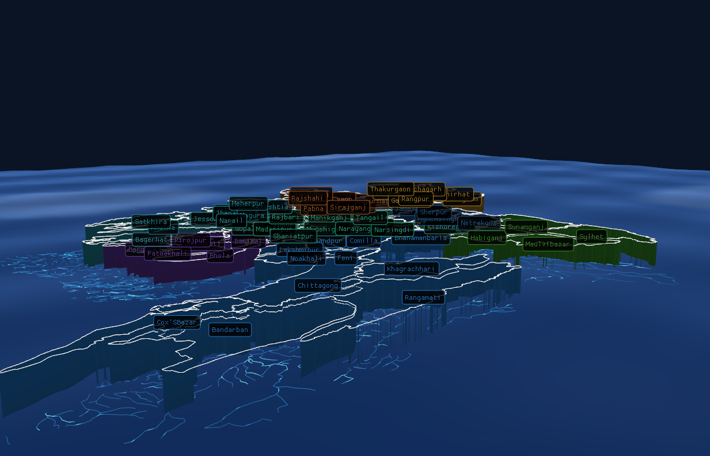
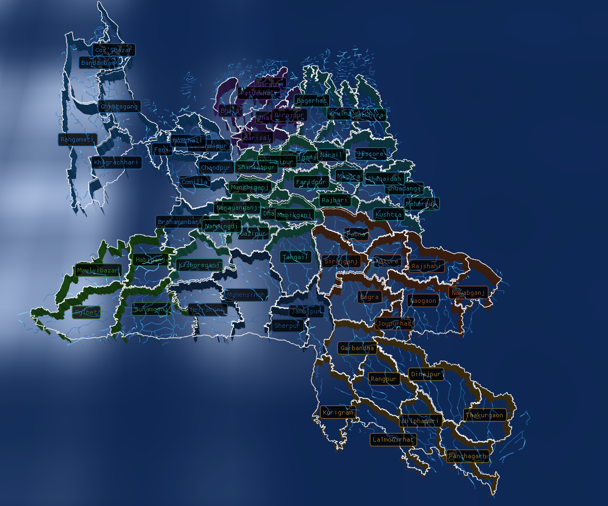

# Bangladesh 3D District Map

[](https://www.opengl.org/)
[](https://isocpp.org/)
[]()
[](LICENSE)

**An interactive 3D visualization of Bangladesh’s administrative boundaries built with modern OpenGL.**

Explore 64 districts, 8 divisions, and dynamic level‑of‑detail rendering in real time. Navigate with intuitive mouse controls, search for any district, and discover geographic information in a beautiful 3D interface.
## The main map
  
## The main functionalities of the MAP

## View functionalities

## Searching districts from dropdown menu

## Searching districs from search menu

## Tilted view 

## Reversed view



---

## ✨ Features

- 🗺️ **Real‑time 3D rendering** – Extruded polygons with division‑based coloring.
- 🖱️ **Interactive camera** – Orbit, pan, and zoom with smooth exponential interpolation.
- 🔍 **Instant search** – Type a district name, get live suggestions, and jump to the location.
- 📂 **Division dropdown** – Select any division to see all its districts.
- 📊 **Info panel** – Displays division, population, area, and capital (where data exists).
- 🌊 **Animated water** – Gerstner waves for the Bay of Bengal.
- 🏞️ **Level of detail (LOD)** – Automatically shows divisions, districts, or upazilas based on camera zoom.
- 🎨 **Division colors** – Each of the 8 divisions has a unique, vibrant color.

---

## 🎮 Controls

| Action               | Control                     |
|----------------------|-----------------------------|
| Orbit camera         | Left mouse drag             |
| Pan                  | Right mouse drag            |
| Zoom                 | Scroll wheel                |
| Select district      | Left click                  |
| Next district        | <kbd>Tab</kbd>              |
| Reset camera         | <kbd>R</kbd>                |
| Deselect             | <kbd>Esc</kbd>              |

---

## 🛠️ Build Instructions

### Prerequisites

- **CMake** 3.18 or higher
- **C++17** compiler (MSVC 2022, GCC 11+, Clang 14+)
- **OpenGL 4.1** compatible GPU
- **Git** (to fetch dependencies)

### Clone & Build

```bash
git clone https://github.com/DevCraftters/BDmaps.git
cd BDmaps
cmake --preset x64-debug
cmake --build out/build/x64-debug
```

## 📁 Project Structure
```

BDmaps/
├── CMakeLists.txt        # Build configuration
├── data/                 # GeoJSON files (districts, divisions, upazilas, rivers)
├── shaders/              # GLSL vertex/fragment shaders
├── src/                  # C++ source files
│   ├── Application.cpp/h
│   ├── Camera.cpp/h
│   ├── Renderer.cpp/h
│   ├── MapData.cpp/h
│   ├── InputHandler.cpp/h
│   ├── Shader.cpp/h
│   └── UIOverlay.cpp/h
├── include/              # Public headers
└── README.md
```
## 🧠 How It Works
- **GeoJSON parsing** – Uses nlohmann/json to read administrative boundaries from GADM data.

- **Coordinate projection** – Converts longitude/latitude to a flat 3D world space.

- **Triangulation** – Turns polygons into triangles with mapbox/earcut.hpp.

- **GPU buffers** – Creates VAOs/VBOs for top faces, side walls, and wireframes.

- **Real‑time rendering** – OpenGL 4.1 Core Profile with Blinn‑Phong lighting, wireframe overlay, and animated water.

- **Level of detail** – Camera distance determines which administrative level (division/district/upazila) is visible.

- **ImGui UI** – Provides division selector, search bar, info panel, and controls help

*Developed with ❤️ for Bangladesh*
